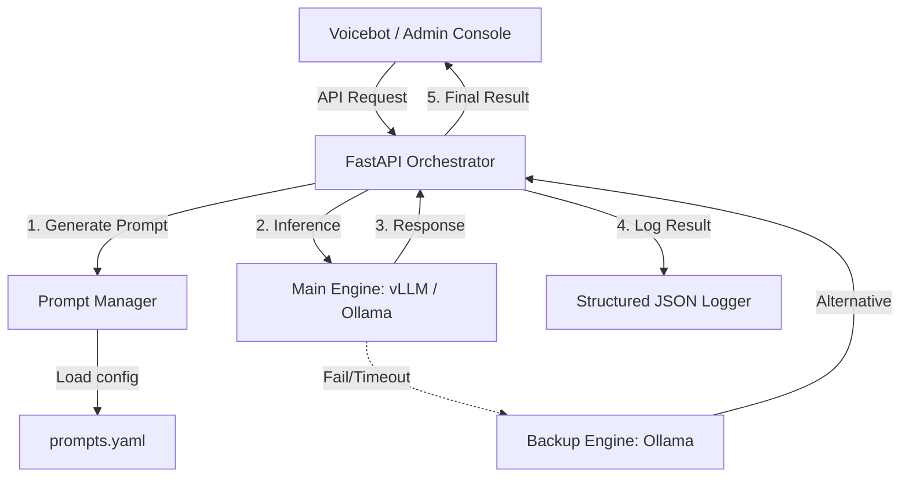

# 🚀 LLMAPI: Enterprise LLM Orchestration Engine for Call Centers

**LLMAPI**는 고객센터(콜센터)의 상담 대화 데이터를 실시간으로 분석하여 **자동 요약, 감정 분석, 상담 카테고리 분류**를 수행하는 지능형 미들웨어 솔루션입니다. 

단순한 API 호출을 넘어, 고성능 상용 엔진(vLLM)과 안정적인 로컬 엔진(Ollama)을 유연하게 오케스트레이션하여 365일 중단 없는 AI 서비스를 제공하며, 상담 품질 관리(QA) 자동화의 핵심 엔진 역할을 수행합니다.

---

## 🌟 핵심 가치 (Core Values)

- **🛡️ 고가용성 (High Availability)**: 메인 엔진 장애 시 1초 이내에 백업 엔진으로 자동 전환하는 **Fail-over** 메커니즘 내장.
- **🚀 하이브리드 추론 (Hybrid Inference)**: 상용 클라우드 GPU 엔진(vLLM)과 온프레미스(Ollama) 엔진을 동시에 지원하여 비용과 성능 최적화.
- **📊 운영 가시성 (Operational Visibility)**: 모든 분석 이력을 **Trace-ID 기반의 구조화된 JSON 로그**로 기록하여 실시간 모니터링 가능.
- **🧬 유연한 도메인 적응 (Domain Agnostic)**: `prompts.yaml` 수정을 통해 코드 변경 없이 상담 분야(보험, 은행, 커머스 등)별 최적화 가능.

---

## 🏗️ 시스템 아키텍처 (Architecture)

### 데이터 흐름도 (Data Flow)


### 디렉토리 구조 (Directory Structure)
```text
LLMAPI/
├── src/
│   ├── api/v1/         # API 엔드포인트 정의 (분석, 헬스체크)
│   ├── core/           # 핵심 설정 (Config, Logging, Prompts YAML)
│   ├── schemas/        # 데이터 검증용 Pydantic 모델
│   ├── services/       # LLM 호출, Fail-over, Retry 비즈니스 로직
│   └── main.py         # 애플리케이션 진입점 및 미들웨어 설정
├── docs/               # 연동 규격서 및 기획 문서
├── tests/              # 품질 검증 및 시스템 통합 테스트 스크립트
├── Dockerfile          # 컨테이너화 설정
└── docker-compose.yaml # 인프라 구성 (FastAPI, Redis 등)
```

---

## 🛠️ 상세 모듈 설명 (Internal Modules)

### 1. `src/services/llm.py` (Orchestration Logic)
*   **OpenAI SDK 호환**: 다양한 백엔드 엔진을 단일 인터페이스로 추론.
*   **장애 극복 (Fail-over)**: 메인 모델 호출 실패 시 `tenacity` 라이브러리를 통해 2회 재시도 후, 즉시 백업 모델로 전환합니다.
*   **JSON 모드 보장**: Llama 3 계열 모델 사용 시 `response_format={"type": "json_object"}`를 강제하여 파싱 에러를 최소화합니다.

### 2. `src/core/prompts.yaml` (Dynamic Prompting)
*   프로젝트의 '뇌' 역할을 하는 파일입니다.
*   `tasks`, `target_speakers` 변수를 바탕으로 시스템 프롬프트가 동적으로 조립됩니다.
*   **Chain-of-Thought** 및 **Few-Shot** 기법이 적용되어 높은 분석 정확도를 유지합니다.

### 3. `src/core/logging.py` (Structured Logging)
*   운영 환경을 위해 `python-json-logger`를 사용합니다.
*   로그 예시:
    ```json
    {"timestamp": "2024-04-10T14:45...", "level": "INFO", "trace_id": "req_123", "latency": 450, "is_fallback": false, "message": "Analysis Completed"}
    ```

---

## 🚀 시작하기 (Installation & Setup)

### 1. 환경 변수 설정
`.env` 파일을 루트 디렉토리에 생성하고 아래와 같이 설정합니다.
```env
# 메인 LLM 설정 (예: vLLM 또는 Ollama)
LLM_BASE_URL=http://host.docker.internal:11434/v1
LLM_MODEL_NAME=llama3.2:3b

# 백업 LLM 설정 (장애 대응용)
LLM_BACKUP_BASE_URL=http://host.docker.internal:11434/v1
LLM_BACKUP_MODEL_NAME=llama3.2:1b
```

### 2. Ollama 네이티브 설정 (Mac 기준)
컨테이너에서 호스트의 Ollama에 접속하기 위해 권한 허용이 필요합니다.
```bash
launchctl setenv OLLAMA_HOST "0.0.0.0"
# Ollama 앱 종료 후 재실행 필수
```

### 3. Docker 실행
```bash
docker compose up --build -d
```

---

## 📄 API 명세 (API Reference)

### 텍스트 분석 요청
`POST /v1/analyze`

**Request Body:**
```json
{
  "request_id": "call_20240410_001",
  "text": "고객: 어제 주문한 상품이 아직 안 왔어요. 상담원: 불편을 드려 죄송합니다. 확인해 보니 물량 폭주로 지연 중입니다.",
  "tasks": ["summary", "sentiment"],
  "target_speakers": "customer"
}
```

**Response Body:**
```json
{
  "request_id": "call_20240410_001",
  "status": "success",
  "results": {
    "summary": "어제 주문한 상품의 배송 지연에 대한 문의.",
    "sentiment": "불만"
  },
  "usage": {
    "total_tokens": 128,
    "latency_ms": 850
  }
}
```

---

## 🧪 품질 검증 (Testing)

- **시스템 테스트**: `python3 tests/system_test.py` (연결성 및 Fail-over 확인)
- **품질 테스트**: `python3 tests/evaluate_prompts.py` (분석 정확도 벤치마크)

---

## 🆘 Troubleshooting

1.  **500 Error (LLM Connection)**: Ollama가 실행 중인지, `OLLAMA_HOST`가 `0.0.0.0`으로 설정되었는지 확인하세요.
2.  **JSON Parsing Error**: 모델의 용량이 너무 작거나 프롬프트가 복잡할 경우 발생할 수 있습니다. `prompts.yaml`의 제약 사항을 강화하세요.
3.  **Docker Network**: Mac 환경에서는 `localhost` 대신 `host.docker.internal`을 사용해야 합니다.

---
**Maintainer**: lkc (kchul199)
**License**: Private
