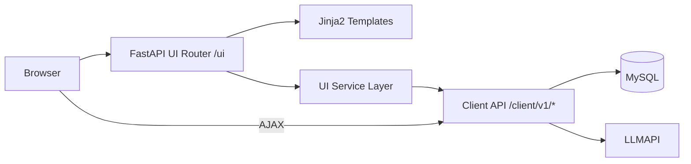
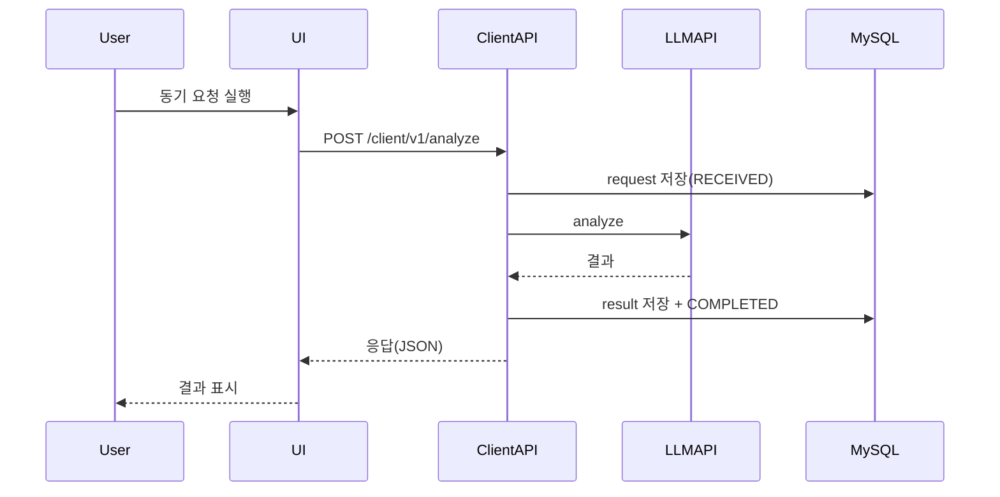
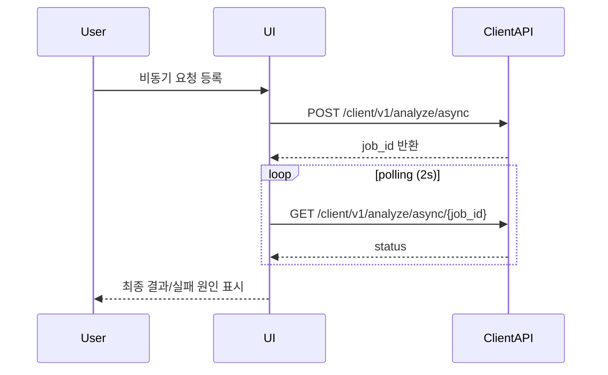

# [설계서] LLMAPI Client 테스트/이력 조회 Web UI (v0.1)

작성일: 2026-04-12  
대상 시스템: `client_gateway`  
문서 목적: 테스트/이력 조회 웹페이지를 구현하기 위한 기술 아키텍처, 컴포넌트 구조, 데이터/연동 설계를 정의한다.
정책: 본 UI는 로그인 페이지 및 로그인 기능을 구현하지 않는다.

---

## 1. 설계 범위

### 1.1 In Scope
- UI 라우트: `/ui`, `/ui/test`, `/ui/history`, `/ui/history/{request_uid}`
- API 연동: 기존 Client API(`/client/v1/*`) 호출
- 대시보드 요약 데이터 조회
- 동기/비동기 테스트 실행
- 요청 이력 목록/상세 조회

### 1.2 Out of Scope
- 로그인/회원관리/세션 인증 기능
- 실시간 웹소켓 대시보드
- 대규모 통계 분석 리포팅

---

## 2. 아키텍처 개요

웹 UI는 `client_gateway` 애플리케이션 내부에 포함한다.  
초기 단계는 학습/운영 편의성을 위해 `Server-Side Rendering(Jinja2) + Vanilla JS`를 사용한다.



핵심 원칙:
- UI와 API를 동일 프로세스에서 운영 (배포 단순화)
- UI는 API 규격을 재사용 (중복 비즈니스 로직 최소화)
- 에러/상태 표시를 UI 공통 포맷으로 통일

---

## 3. 기술 스택

### 3.1 Backend
- Python 3.11+ (현재 3.13 호환 의존성 반영)
- FastAPI
- Jinja2 (템플릿)
- Pydantic (입출력 모델)

### 3.2 Frontend
- HTML5 + CSS3
- Vanilla JavaScript (Fetch API)
- 선택: HTMX (간단한 부분 업데이트 필요 시)

### 3.3 데이터/연동
- MySQL: 요청/결과/상태이력 저장
- Redis: 비동기 큐 사용 시 상태 체크
- LLMAPI: 실제 분석 수행 대상

---

## 4. 모듈 설계

권장 디렉터리 구조:

```text
client_gateway/
  app/
    ui/
      router.py
      schemas.py
      services.py
      static/
        css/ui.css
        js/ui_common.js
        js/ui_test.js
        js/ui_history.js
      templates/
        base.html
        dashboard.html
        test.html
        history_list.html
        history_detail.html
```

### 4.1 UI Router (`app/ui/router.py`)
- `GET /ui`
- `GET /ui/test`
- `GET /ui/history`
- `GET /ui/history/{request_uid}`
- 역할: 템플릿 렌더링 + 초기 페이지 데이터 주입

### 4.2 UI Service (`app/ui/services.py`)
- 기존 `AnalyzeService`/Repository를 직접 사용하거나 REST로 재호출
- 대시보드 통계용 조회 함수 제공

### 4.3 Static JS
- `ui_test.js`: 테스트 실행/결과 렌더링/폴링
- `ui_history.js`: 검색/페이지네이션/상세 이동
- `ui_common.js`: 공통 에러 처리, 날짜 포맷, 복사 기능

---

## 5. 화면-API 연동 설계

| 화면 | 호출 API | HTTP | 목적 |
| :--- | :--- | :--- | :--- |
| 테스트(sync) | `/client/v1/analyze` | POST | 동기 분석 실행 |
| 테스트(async 등록) | `/client/v1/analyze/async` | POST | 비동기 작업 생성 |
| 테스트(async 조회) | `/client/v1/analyze/async/{job_id}` | GET | 비동기 상태 폴링 |
| 이력 목록 | `/client/v1/requests` | GET | 검색/페이지 조회 |
| 이력 상세 | `/client/v1/requests/{request_uid}` | GET | 단건 상세 조회 |
| 대시보드 헬스 | `/client/v1/health` | GET | 연결 상태 표시 |

### 5.1 UI 전용 집계 API (권장)

대시보드 카드 성능을 위해 아래 API 추가를 권장한다.

- `GET /client/v1/ui/dashboard-summary`
  - 오늘 총 요청 건수
  - 실패 건수
  - 상태별 카운트
  - 최근 실패 5건

---

## 6. 데이터 모델 (UI ViewModel)

### 6.1 DashboardSummary

```json
{
  "date": "2026-04-12",
  "total_requests_today": 120,
  "failed_today": 8,
  "status_counts": {
    "RECEIVED": 3,
    "QUEUED": 7,
    "PROCESSING": 2,
    "COMPLETED": 100,
    "FAILED": 6,
    "TIMEOUT": 2
  },
  "recent_failed": [
    {
      "request_uid": "...",
      "source_system": "qa-admin",
      "error_code": "UPSTREAM_TIMEOUT",
      "updated_at": "2026-04-12T10:31:22"
    }
  ]
}
```

### 6.2 TestExecutionResult

```json
{
  "mode": "sync",
  "http_status": 200,
  "request_uid": "...",
  "trace_id": "...",
  "job_id": null,
  "status": "COMPLETED",
  "result": {"summary": "..."},
  "error": null
}
```

---

## 7. 상태/시퀀스 설계

### 7.1 동기 테스트 시퀀스



### 7.2 비동기 테스트 시퀀스



---

## 8. 보안 설계

### 8.1 접근 제어
- 내부망 한정 운영(1차)
- UI 로그인/세션 인증 기능 미구현
- 접근통제는 인프라 레벨(IP 허용 목록, 사내 VPN)에서 처리

### 8.2 데이터 보호
- 원문 텍스트 저장 금지(마스킹 텍스트만 저장)
- 상세 화면에서도 마스킹 텍스트 그대로 노출
- 브라우저 console에 민감 데이터 출력 금지

### 8.3 감사 추적
- UI 액션 로그(조회/테스트 실행)
- `trace_id`, `request_uid`, 호출자 IP 기록

---

## 9. 성능/운영 설계

### 9.1 성능 목표
- 페이지 첫 렌더: 2초 이내
- 이력 조회 API: 1초 이내(기본 페이지 20건)
- 비동기 폴링: 2초 간격, 최대 60회(2분)

### 9.2 운영 기준
- API 오류율 > 5% 5분 지속 시 알람
- TIMEOUT 증가 추세(전일 대비 2배) 알람

### 9.3 장애 대응
- LLMAPI 불가 시 테스트 화면에 즉시 경고 배너
- DB 연결 실패 시 이력 화면 읽기 비활성화 + 안내

---

## 10. 테스트 설계

### 10.1 기능 테스트
1. 동기 요청 성공/실패
2. 비동기 등록 성공/상태 완료/실패
3. 중복 요청(409) 표시
4. 필터 조회/페이지네이션
5. 상세 화면 상태 타임라인 정합성

### 10.2 UI 테스트
- 폼 입력 검증
- 로딩/오류/빈 상태 렌더링
- 모바일 레이아웃 전환

### 10.3 회귀 테스트
- 기존 `/client/v1/*` API 동작 영향 여부

---

## 11. 단계별 구현 계획

### Phase 1 (MVP)
- UI Router + Template 4종
- 테스트/이력/상세 화면
- 기본 CSS/JS

### Phase 2
- 대시보드 요약 통계
- 최근 실패 목록
- 재테스트 프리필

### Phase 3
- CSV 다운로드
- 실패 재처리 버튼
- 사용자 권한 분리

---

## 12. 오픈 기술 이슈

1. UI와 API를 같은 프로세스로 둘지(단순) 분리 배포할지(확장)
2. 폴링 방식 유지 vs SSE/WebSocket 전환
3. 프론트엔드 프레임워크 도입 시점(React/Vue)
