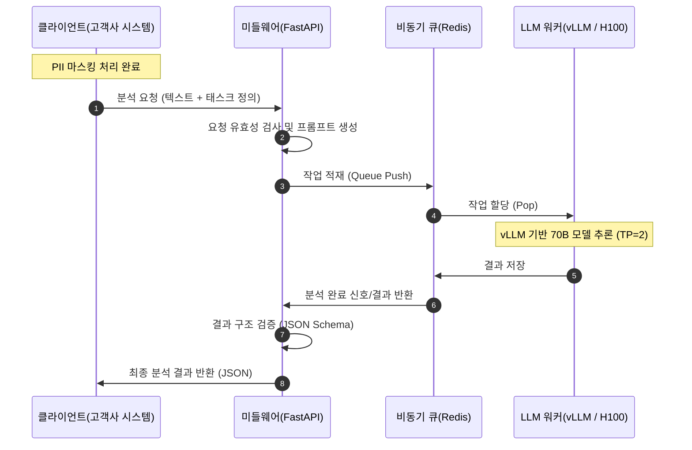

# [설계서] LLMAPI 시스템 아키텍처 및 인터페이스 설계 (v1.0)

본 문서는 상담 텍스트 분석을 위한 LLMAPI 시스템의 상세 설계를 다룹니다. 초보 개발자도 시스템 전체 흐름을 이해하고 구현할 수 있도록 상세히 서술되었습니다.

## 1. 시스템 전체 흐름도 (Data Flow)

아래 다이어그램은 클라이언트의 요청이 어떻게 처리되고 반환되는지 보여줍니다.



## 2. 물리적 인프라 구성 (Deployment)

고성능 H100 GPU 자원을 효율적으로 사용하여 가용성을 높입니다.

*   **Server A (개발 및 검증 노드)**
    *   **GPU #0**: 개발용 (Dev) - 신규 모델 테스트 및 코드 개발
    *   **GPU #1-2**: 검수용 (QA) - 텐서 병렬처리(TP=2)를 통한 상용급 부하 테스트
*   **Server B (상용 운영 노드)**
    *   **GPU #0-1**: 상용 전용 (Prod) - 외부 간섭 없이 안정적인 추론 서비스 제공 (TP=2)

## 3. 확장 가능한 API 규격 설계

다양한 분석 요구사항에 대응하기 위해 `Task` 기반의 유연한 구조로 설계되었습니다.

### 3.1 분석 요청 (Request)
*   **Base URL**: `http://llmapi.server/v1/analyze`
*   **Method**: `POST`

```json
{
  "request_id": "req_20240410_001",
  "text": "안녕하세요, 오늘 배송받은 상품에 하자가 있어서 전화드렸습니다. 어떻게 처리해야 하나요?",
  "tasks": ["summary", "category", "sentiment"], 
  "options": {
    "language": "ko",
    "prompt_version": "v1.2"
  }
}
```
> **Tip**: `tasks` 필드에 리스트 형태로 분석 항목을 전달하여, 나중에 '핵심 키워드 추출' 등이 추가되더라도 API 주소 변경 없이 확장 가능합니다.

### 3.2 분석 응답 (Response)

```json
{
  "request_id": "req_20240410_001",
  "status": "success",
  "results": {
    "summary": "배송된 상품의 하자로 인한 교환/환불 절차 문의.",
    "category": "배송/품질",
    "sentiment": "negative"
  },
  "usage": {
    "total_tokens": 150,
    "latency_ms": 1200
  }
}
```

## 4. 핵심 구성 요소 및 역할

### 4.1 미들웨어 (FastAPI)
- **프롬프트 래핑**: 클라이언트가 보낸 원문을 LLM이 이해하기 쉬운 형태(페르소나 + 지시어)로 포장합니다.
- **결과 검증**: LLM이 반환한 텍스트가 정확한 JSON 형태인지, 필수 필드가 포함되었는지 검사합니다.

### 4.2 비동기 큐 (Redis)
- **속도 제어**: 한꺼번에 많은 요청이 들어와도 GPU가 감당할 수 있는 속도로 전달하여 서버 다운(OOM)을 방지합니다.

### 4.3 추론 엔진 (vLLM)
- **텐서 병렬처리 (TP=2)**: 70B 모델처럼 거대한 모델을 2장의 GPU에 나누어 적재하고 병렬로 계산하여 응답 속도를 일반 서버 대비 수배 이상 높입니다.

## 5. 구현 시 주의사항 (Guide)

1.  **에러 핸들링**: LLM 응답이 부정확할 경우(예: JSON 형식이 깨짐)를 대비하여 미들웨어에서 재시도(Retry) 로직 또는 기본값 반환 처리를 구현해야 합니다.
2.  **보안**: 클라이언트에서 마스킹된 데이터가 들어오는지 서버 측에서도 샘플링 검사를 수행하는 것이 좋습니다.
3.  **성능**: vLLM 설정 시 `max-model-len`을 적절히 조절하여 GPU 메모리 사용량을 최적화하십시오.
