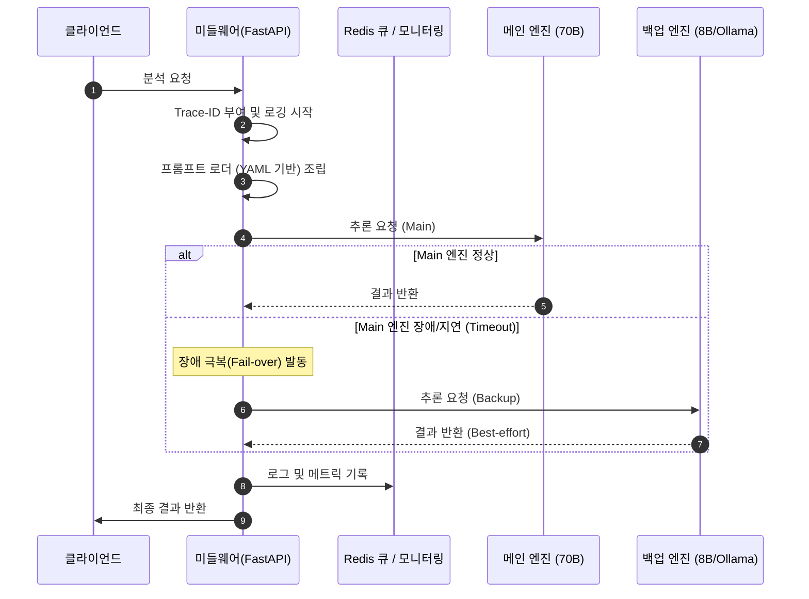

# [설계서] LLMAPI 고도화 아키텍처 및 상세 설계 (v1.1)

본 문서는 상용 수준의 운영 안정성을 보장하기 위해 고도화된 LLMAPI 시스템의 아키텍처를 다룹니다.

## 1. 고도화된 시스템 흐름도 (Data Flow with Fail-over)

아래 다이어그램은 메인 엔진 장애 시 백업 엔진으로 전환되는 과정과 모니터링 체계를 보여줍니다.



## 2. 4대 핵심 아키텍처 설계

### 2.1 운영성: 구조화된 로깅 및 Health Check
- **JSON Logging**: 로그를 정형화하여 검색 및 분석 효율 증대.
- **Trace-ID Middleware**: 모든 요청에 고유 ID를 부여하여 전체 흐름 추적 가능.
- **Health Endpoint**: `/health` 엔드포인트를 통해 서버 및 백엔드 엔진 상태 실시간 확인.

### 2.2 유연성: 프롬프트 및 모델 설정 분리
- **`prompts.yaml`**: 배포 없이 프롬프트를 변경할 수 있도록 외부 파일로 격리.
- **Dynamic Routing**: 요청 파라미터나 서버 상태에 따라 태스크별 최적의 모델로 라우팅.

### 2.3 확장성: Redis 비동기 처리
- **Message Broker**: Redis를 메시지 브로커로 활용하여 대량의 요청을 버퍼링.
- **Worker Scale-out**: 추론 엔진의 성능에 맞춰 워커 노드를 유연하게 증설 가능한 구조.

### 2.4 안정성: Retry & Fail-over
- **Retry Logic**: 일시적인 네트워크 순만(Glitch) 발생 시 `Tenacy`를 이용한 자동 재시도.
- **Fallback Strategy**: 서버 오류나 타임아웃 발생 시 사전에 정의된 백업 모델로 즉시 전환.

## 3. 인터페이스 확장 (API Spec v1.1)

### 3.1 Health Check API
*   **Endpoint**: `GET /health`
*   **Response**:
```json
{
  "status": "healthy",
  "version": "1.1.0",
  "checks": {
    "redis": "connected",
    "main_llm": "online",
    "backup_llm": "online"
  }
}
```

## 4. 운영 시나리오 가이드

1.  **메인 서버 점검 시**: 점검 중에도 백업 서버를 통해 분석 서비스는 계속 유지됩니다.
2.  **프롬프트 수정 시**: `prompts.yaml` 파일 수정 만으로 실시간으로 분석 퀄리티를 최적화할 수 있습니다.
3.  **트래픽 급증 시**: Redis 큐에 요청이 적재되며, 가용 리소스에 맞춰 순차적으로 안전하게 처리됩니다.
