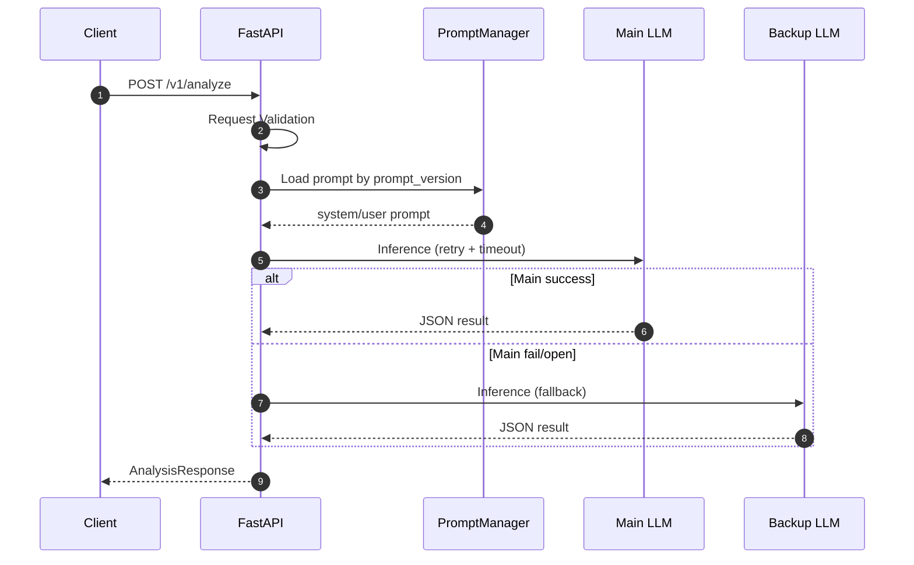

# [설계서] LLMAPI 아키텍처 설계서 (현행 v2.0)

작성일: 2026-04-12  
대상 독자: 백엔드 개발자, 운영자, 초급 엔지니어

---

## 1. 설계 목표

이 문서는 현재 구현된 LLMAPI의 기술 구조를 설명한다.
특히 다음을 중점으로 한다.

1. 장애 상황에서도 서비스 지속
2. 확장 가능한 동기/비동기 처리
3. 운영자가 상태를 쉽게 확인 가능한 구조

---

## 2. 시스템 구성 요소

### 2.1 API Layer
- 기술: FastAPI
- 역할:
  - 요청 검증
  - 동기 분석 처리
  - 비동기 큐 등록/조회
  - Health 응답 제공

### 2.2 Prompt Layer
- 파일: `src/core/prompts.yaml`
- 모듈: `src/services/prompts.py`
- 역할:
  - 프롬프트 템플릿 로딩
  - 파일 변경 감지 후 재로딩
  - `prompt_version` 기반 템플릿 선택

### 2.3 LLM Orchestration Layer
- 모듈: `src/services/llm.py`
- 역할:
  - 메인 모델 호출
  - Retry/Fail-over
  - Circuit Breaker 상태 관리
  - Timeout 정책 적용

### 2.4 Queue Layer (Optional)
- 모듈: `src/services/queue.py`
- 저장소: Redis
- 역할:
  - 비동기 작업 큐잉
  - 워커 소비
  - 작업 상태 저장/조회

### 2.5 Observability Layer
- 모듈: `src/core/logging.py`
- 역할:
  - 구조화 JSON 로그
  - `trace_id` 기반 추적

---

## 3. 배포 구조

### 3.1 Docker Compose 기본 구성
- `api`: FastAPI 서버
- `redis`: 큐/상태 저장

### 3.2 로컬/개발 환경 포트
- API: `8001`
- Redis: `6379`

---

## 4. 데이터 흐름

### 4.1 동기 분석 흐름

### 4.2 비동기 분석 흐름

```mermaid
sequenceDiagram
    autonumber
    participant Client
    participant API as FastAPI
    participant R as Redis
    participant W as Queue Worker
    participant LLM as LLMService

    Client->>API: POST /v1/analyze/async
    API->>R: Save Job + Push Queue
    API-->>Client: job_id (202)

    W->>R: BLPOP queue
    W->>R: status=processing
    W->>LLM: analyze()
    LLM-->>W: result/error
    W->>R: status=completed/failed

    Client->>API: GET /v1/analyze/async/{job_id}
    API->>R: Read job data
    API-->>Client: job status payload
```

---

## 5. 안정성 설계

### 5.1 Retry
- 적용 위치: LLM 호출 함수
- 파라미터:
  - `LLM_RETRY_ATTEMPTS`
  - `LLM_RETRY_MIN_WAIT_SECONDS`
  - `LLM_RETRY_MAX_WAIT_SECONDS`

### 5.2 Fail-over
- 메인 모델 실패 시 백업 모델 자동 전환
- 백업 모델은 별도 URL/모델명 사용 가능

### 5.3 Circuit Breaker
- 대상: 메인/백업 각각 독립 관리
- 상태:
  - `closed`: 정상 호출
  - `open`: 일정 시간 호출 차단
  - `half_open`: 제한된 테스트 호출 허용

관련 설정:
- `LLM_CB_FAILURE_THRESHOLD`
- `LLM_CB_RECOVERY_SECONDS`
- `LLM_CB_HALF_OPEN_MAX_CALLS`

### 5.4 Timeout Policy
- 태스크별 timeout 분리
  - `summary`: 상대적으로 길게
  - `sentiment`, `category`: 상대적으로 짧게
- 다중 태스크 요청 시 오버헤드 추가

---

## 6. API/스키마 설계

### 6.1 주요 요청 모델
- `AnalysisRequest`
  - `request_id`
  - `text`
  - `tasks` (`summary`, `sentiment`, `category`)
  - `target_speakers` (`agent`, `customer`, `both`)
  - `options.prompt_version`

### 6.2 주요 응답 모델
- `AnalysisResponse`
- `AsyncAnalyzeEnqueueResponse`
- `AsyncAnalyzeStatusResponse`

---

## 7. 설정값 맵 (핵심)

### 7.1 LLM
- `LLM_BASE_URL`, `LLM_MODEL_NAME`
- `LLM_BACKUP_BASE_URL`, `LLM_BACKUP_MODEL_NAME`

### 7.2 안정성 정책
- Retry/Circuit/Timeout 관련 환경변수

### 7.3 Queue
- `REDIS_QUEUE_ENABLED`
- `REDIS_QUEUE_KEY`
- `REDIS_JOB_KEY_PREFIX`
- `REDIS_QUEUE_WORKER_CONCURRENCY`

---

## 8. 운영 관점 체크리스트

### 8.1 Health 점검
`GET /v1/health`에서 확인:
- `llm.runtime.circuit_breaker`
- `prompt_config.available_versions`
- `queue.enabled`, `queue.ready`, `queue.queue_depth`

### 8.2 로그 점검
- 오류 요청의 `trace_id`로 검색
- `LLM Upstream Error` 빈도 추적

### 8.3 큐 점검
- queue depth 증가 추이
- failed job 비율

---

## 9. 확장 가이드

### 9.1 DLQ 추가
- 실패 횟수 기준으로 실패 큐 분리

### 9.2 멀티 워커
- `REDIS_QUEUE_WORKER_CONCURRENCY` 증가
- CPU/네트워크 상황에 맞게 단계적 조정

### 9.3 모델 어댑터 계층
- 벤더별 파라미터 차이 추상화

---

## 10. 파일 참조

- `src/main.py`: 앱 생성/수명주기
- `src/api/v1/endpoints.py`: API 엔드포인트
- `src/services/llm.py`: LLM 오케스트레이션
- `src/services/queue.py`: 큐 처리
- `src/services/prompts.py`: 프롬프트 관리
- `src/core/config.py`: 환경설정
