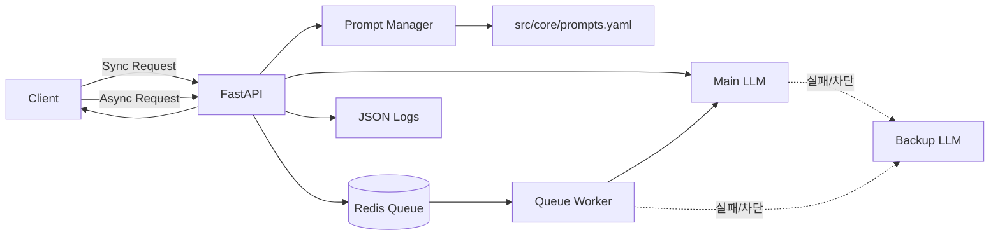

# LLMAPI README (현행 기준)

문서 버전: v2.0  
최종 수정일: 2026-04-12

---

## 1. 프로젝트 개요

### 1.1 LLMAPI가 무엇인가요?
LLMAPI는 콜센터 상담 대화를 입력받아 다음 결과를 자동으로 생성하는 API 서버입니다.

- 요약(`summary`)
- 감정 분석(`sentiment`)
- 카테고리 분류(`category`)

FastAPI로 구현되어 있으며, OpenAI 호환 API(vLLM, Ollama 등)에 연결해 추론합니다.

### 1.2 왜 필요한가요?
기존에는 상담 내용을 사람이 직접 읽고 분류해야 했기 때문에 시간이 오래 걸리고 기준이 일관되지 않았습니다.  
LLMAPI를 사용하면 동일한 규칙으로 빠르게 분석할 수 있어 QA(품질관리) 효율이 올라갑니다.

### 1.3 현재 구현된 핵심 기능

- 동기 분석 API: `POST /v1/analyze`
- 비동기 분석 API(큐): `POST /v1/analyze/async`, `GET /v1/analyze/async/{job_id}`
- 상태 점검 API: `GET /v1/health`
- 입력값 검증(허용 태스크만, 빈 값 차단)
- Retry + Fail-over(메인 실패 시 백업 모델)
- Circuit Breaker(연속 실패 시 일시 차단)
- 태스크별 Timeout 정책
- 프롬프트 버전 라우팅(`options.prompt_version`)
- Redis 기반 비동기 큐 워커(옵션)
- 구조화된 JSON 로그(`trace_id` 포함)

---

## 2. 아키텍처 구조

### 2.1 전체 흐름



### 2.2 동기 분석 처리 순서

1. 클라이언트가 `/v1/analyze` 호출
2. 요청 스키마 검증
3. 프롬프트 템플릿 로드(버전 선택 가능)
4. 메인 LLM 호출
5. 실패 시 재시도, 필요하면 백업 LLM으로 전환
6. JSON 결과 정규화 후 응답

### 2.3 비동기 분석 처리 순서

1. 클라이언트가 `/v1/analyze/async` 호출
2. 서버가 Redis 큐에 작업 저장 후 `job_id` 즉시 반환
3. 워커가 큐에서 작업 소비
4. 분석 완료/실패 상태를 Redis Job Key에 저장
5. 클라이언트가 `/v1/analyze/async/{job_id}`로 폴링

### 2.4 신뢰성 설계 포인트

- Retry: 일시 네트워크 오류 자동 재시도
- Fail-over: 메인 모델 실패 시 백업 모델 전환
- Circuit Breaker: 연속 실패 구간에서는 호출을 빠르게 차단
- Timeout Policy: 태스크별 최대 대기시간 분리

---

## 3. 설치 매뉴얼 (초보자용)

### 3.1 사전 준비

필수 도구:

- Docker Desktop
- Git

선택 도구(로컬 실행 시):

- Python 3.9~3.12 권장

> 참고: Python 3.13에서는 일부 의존성(`pydantic-core`) 빌드 문제가 발생할 수 있습니다.

### 3.2 저장소 준비

```bash
git clone https://github.com/kchul199/LLMAPI.git
cd LLMAPI
```

### 3.3 `.env` 설정

프로젝트 루트에 `.env` 파일을 만들고 아래 값을 확인합니다.

```env
PROJECT_NAME=LLMAPI
APP_VERSION=1.2.0
API_V1_STR=/v1

LLM_BASE_URL=http://host.docker.internal:11434/v1
LLM_API_KEY=not_needed_for_ollama
LLM_MODEL_NAME=llama3.2:3b

LLM_BACKUP_BASE_URL=http://host.docker.internal:11434/v1
LLM_BACKUP_MODEL_NAME=llama3.2:1b

LLM_RETRY_ATTEMPTS=2
LLM_RETRY_MIN_WAIT_SECONDS=1
LLM_RETRY_MAX_WAIT_SECONDS=4
LLM_CB_FAILURE_THRESHOLD=3
LLM_CB_RECOVERY_SECONDS=30
LLM_CB_HALF_OPEN_MAX_CALLS=1

LLM_TIMEOUT_MIN_SECONDS=10
LLM_TIMEOUT_SUMMARY_SECONDS=45
LLM_TIMEOUT_SENTIMENT_SECONDS=25
LLM_TIMEOUT_CATEGORY_SECONDS=25
LLM_TIMEOUT_MULTI_TASK_OVERHEAD_SECONDS=8
LLM_TIMEOUT_BACKUP_MULTIPLIER=0.8

REDIS_HOST=redis
REDIS_PORT=6379
REDIS_DB=0
REDIS_QUEUE_ENABLED=false
REDIS_QUEUE_KEY=llmapi:analysis:queue
REDIS_JOB_KEY_PREFIX=llmapi:analysis:job
REDIS_JOB_TTL_SECONDS=600
REDIS_QUEUE_WORKER_CONCURRENCY=1

LOG_LEVEL=INFO
PROMPT_CONFIG_FILE=src/core/prompts.yaml
ALLOWED_HOSTS=["*"]
```

#### 비동기 큐를 사용하려면?
- `REDIS_QUEUE_ENABLED=true`로 변경
- `docker compose`로 Redis 컨테이너가 실행 중인지 확인

---

## 4. 실행 방법

### 4.1 Docker 실행 (권장)

```bash
docker compose up --build -d
```

확인:

```bash
curl -s http://localhost:8001/v1/health
```

### 4.2 로컬 실행

```bash
python3 -m pip install -r requirements.txt
python3 -m uvicorn src.main:app --host 0.0.0.0 --port 8001 --reload
```

---

## 5. API 빠른 사용법

### 5.1 동기 분석

```bash
curl -X POST http://localhost:8001/v1/analyze \
  -H "Content-Type: application/json" \
  -d '{
    "request_id": "req_sync_001",
    "text": "고객: 배송이 너무 늦어요. 상담원: 확인 후 안내드리겠습니다.",
    "tasks": ["summary", "sentiment", "category"],
    "target_speakers": "customer",
    "options": {"language": "ko", "prompt_version": "v1.1"}
  }'
```

### 5.2 비동기 분석

1) 작업 등록

```bash
curl -X POST http://localhost:8001/v1/analyze/async \
  -H "Content-Type: application/json" \
  -d '{
    "request_id": "req_async_001",
    "text": "고객: 주문 취소하고 싶어요. 상담원: 접수 도와드리겠습니다.",
    "tasks": ["summary"],
    "target_speakers": "customer"
  }'
```

2) 상태 조회

```bash
curl -s http://localhost:8001/v1/analyze/async/<job_id>
```

---

## 6. 테스트 방법

### 6.1 단위 테스트

```bash
python3 -m unittest discover -s tests -p "test_*.py"
```

### 6.2 컴파일 체크

```bash
python3 -m compileall src tests
```

### 6.3 Docker 환경 테스트(권장)

```bash
docker compose run --rm api python -m unittest discover -s tests -p "test_*.py"
```

---

## 7. 트러블슈팅

### 7.1 `422 Unprocessable Entity`
원인:
- 요청 JSON의 필수 필드 누락
- `tasks`에 허용되지 않은 값 포함

해결:
- `tasks`는 `summary`, `sentiment`, `category`만 사용
- `request_id`, `text`가 빈 문자열이 아닌지 확인

### 7.2 `502 Bad Gateway` (`LLM 추론 엔진 호출 실패`)
원인:
- 메인/백업 LLM 엔드포인트 불가
- 모델명 오타 또는 엔진 미실행

해결:
1. `LLM_BASE_URL`, `LLM_BACKUP_BASE_URL` 확인
2. LLM 서버 상태 확인
3. `/v1/health`의 `llm.runtime.circuit_breaker` 상태 확인

### 7.3 `503 Service Unavailable` (비동기 큐)
원인:
- `REDIS_QUEUE_ENABLED=false`
- Redis 연결 실패

해결:
1. `.env`에서 `REDIS_QUEUE_ENABLED=true`
2. `docker compose ps`에서 `redis` 상태 확인
3. `/v1/health`의 `queue.ready` 확인

### 7.4 프롬프트 버전이 반영되지 않을 때
원인:
- `options.prompt_version` 값에 해당하는 키가 `prompts.yaml`에 없음

해결:
- 예: `prompt_version: "v1.1"`이면 아래 키가 필요
  - `analysis_system_prompt_v1_1`
  - `analysis_user_message_v1_1`

### 7.5 macOS에서 LLM 연결이 안 될 때
원인:
- Docker 컨테이너에서 `localhost`는 컨테이너 자신을 의미

해결:
- `.env`에 `host.docker.internal` 사용

---

## 8. 참고 문서

- [기획서(현행)](./LLMAPI_기획서_현행_v2_0.md)
- [아키텍처 설계서(현행)](./LLMAPI_아키텍처_설계서_현행_v2_0.md)
- [연동 규격서(현행)](./LLMAPI_연동규격서_현행_v2_0.md)
- [Client 기획서](./Client_기획서_v0_2.md)
- [Client 기능요건서](./Client_기능요건서_v0_2.md)
- [Client DB 설계서](./Client_DB_설계서_v0_1.md)
- [Client 기획/요건 검토보고서](./Client_기획요건_검토보고서_v0_1.md)
- [Client WebUI 화면기획서](./Client_WebUI_화면기획서_v0_1.md)
- [Client WebUI 설계서](./Client_WebUI_설계서_v0_1.md)
- [Client WebUI 기능정의서](./Client_WebUI_기능정의서_v0_1.md)
- [이전 문서 백업](./backup)
